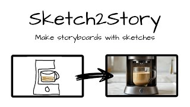

# Sketch2Story

Transform rough sketches and images into polished storyboard frames with AI assistance.

## What is Sketch2Story?

Sketch2Story is a storyboarding tool that lets you quickly sketch out scenes, upload reference images, and convert them into finished storyboard panels. Whether you're planning a film, animation, commercial, or any visual narrative, Sketch2Story streamlines the process of turning rough ideas into production-ready boards.

## YouTube Video (click on image)

## Features

### Sketch and Upload
- Draw directly into panels with a customizable brush (2-16px)
- Pick any color from an HSL color picker
- Upload reference images or photographs
- Organize panels in a timeline

### AI-Powered Enhancement
- Convert rough sketches to polished images using the Bria API
- Enhance uploaded images with detailed descriptions
- Use the AI sparkles button to auto-generate:
  - Compelling panel titles
  - Optimal frame durations for pacing
  - Director's notes about composition and mood
- The AI analyzes neighboring panels for visual continuity

### Frame Timing
- Set custom durations per panel (1-10 seconds) with a non-linear slider
- Durations affect video export pacing

### Scoping and Notes
- Create scenes to organize your story
- Add beats and director's notes to each panel
- Tag panels with scenes for context during generation

### Export
- Render your storyboard as a video (WebM format)
- Each frame displays for its set duration
- Ready to share or present

## How to Use

### Getting Started
1. Click "New project" to create a storyboard
2. Choose a panel aspect ratio (16:9 or 9:16)
3. Start adding panels

### Adding Content
- Click "Add panel" to create a blank drawing canvas
- Use the color picker (circular button) to choose your brush color
- Adjust brush size with the slider
- Click "Upload image" to use photos or references

### Converting Sketches
- For drawn panels, click "Convert to Image"
- Describe the scene with details about characters, lighting, mood, and camera intent
- Select a scene for context if you've created one
- The AI will generate a realistic frame based on your sketch

### AI Enhancement (Sparkles Button)
- On image panels, click the sparkles button
- The AI analyzes the image and neighboring panels
- Automatically fills in title, duration, and notes
- Edit the results if needed

### Timing Your Panels
- Use the duration slider under each image to set how long it appears
- Durations range from 1s to 10s with a curved response
- Affects pacing in the exported video

### Exporting
- Go to the Export tab
- Click "Export to video"
- Each panel displays for its set duration
- Download the rendered WebM file

## Settings

### API Keys
You'll need two API keys for full AI features:
- **Bria API token**: For converting sketches to images (get one at bria.ai)
- **OpenAI API key**: For AI enhancement and scene rewriting (get one at openai.com)

Enter these in Settings. They're stored locally on your device and never sent to external servers except the respective APIs.

### Panel Aspect
Switch between 16:9 (widescreen) and 9:16 (vertical) layouts. Affects all panels in the project.

## Keyboard Shortcuts

- Press Escape to close any dialog or color picker
- Edit the project title by clicking it directly

## Tips

- Keep sketches simple and clear - the AI understands composition and intent
- Use the notes field to add cinematography details the AI might miss
- Organize with scenes to help the AI understand your narrative flow
- Duplicate panels as a starting point for similar shots
- Experiment with different durations to find the right pacing for your story
- Export multiple versions to compare timing and presentation

## Storage

All projects are stored in your browser's local storage. Your data never leaves your device unless you explicitly call the AI APIs. Clear your browser data to delete projects.